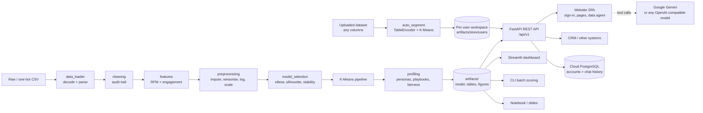

# Customer Segmentation: From Raw Customer Data to Responsible Business Actions

> **How to use this README for a presentation**
> Each `## Slide N` section below is one slide. Use the **title** as the slide heading, the **bullets** as the body,
> the **Visual** as the chart/image (all images are in `artifacts/figures/`), and the **Speaker notes** as the presenter notes.
> The numbers come from the latest model run (`artifacts/model_card.json`). If you retrain, update them.

---

## Slide 1: Customer Segmentation – Title

- Discovering meaningful customer segments from raw customer data
- Turning segments into practical, responsible engagement actions
- Deliverables: segmentation model, Jupyter notebook, interactive dashboard, reusable Python package

**Visual:** `artifacts/figures/07_pca_segments.png` (as a background or hero image)

**Speaker notes:** Every customer is different. Some buy often, some spend a lot, some only show up for special offers. This project finds those groups in the data and explains how to serve each one responsibly.

---

## Slide 2: Business Problem and Objective

- **Problem:** one-size-fits-all marketing wastes budget and irritates customers
- **Objective:** group customers into meaningful segments and explain how each should be served
- **Questions answered:**
  - How many distinct customer groups exist, and why that number?
  - What defines each group (spend, frequency, recency, channel, engagement)?
  - Which actions should each group get, and what should we avoid?

**Visual:** none (text slide), or a simple icon row: Data → Segments → Actions

**Speaker notes:** The goal is decisions, not just clusters. Every segment should come with a clear goal, next best actions and KPIs.

---

## Slide 3: Dataset Overview

- **2,240 customers**, 2 years of purchase history (retail: wine, meat, fish, fruit, sweets, gold)
- **Spending:** amount spent on 6 product categories
- **Frequency and channel:** web, catalog, store and discounted purchases; monthly web visits
- **Recency:** days since last purchase
- **Engagement:** acceptance of 6 marketing campaigns, complaints
- **Demographics:** birth year, income, children, education, marital status, enrolment date
- The file arrived **one-hot encoded (699 columns)**, including 662 dummy columns for the enrolment date alone

**Visual:** `artifacts/figures/01_behaviour_overview.png`

**Speaker notes:** Clustering on hundreds of sparse date dummies would be meaningless, so the loader first collapses the dummy columns back into categorical values and a proper date.

---

## Slide 4: Data Quality Issues Found

| Issue | Records affected |
|---|---|
| Same customer profile under a different ID (re-registrations) | 183 |
| Birth year before 1920 (implausible age) | 3 |
| Income of 666,666 (data-entry error) | 1 |
| Spend recorded with zero purchases (inconsistent) | 6 |
| Deal purchases > total purchases | 1 (capped) |
| Messy categories (`Alone`, `Absurd`, `YOLO`) | 7 |
| Constant columns (`Z_CostContact`, `Z_Revenue`) | 2 columns |

- **Result:** 2,240 raw rows → **2,047 clean customers** (8.6% removed), every step logged in an audit trail

**Visual:** table above, or `artifacts/cleaning_report.csv`

**Speaker notes:** Duplicates would double-count some behaviours and bias the centroids. Every rule is written down and logged, so the cleaning can be audited and repeated.

---

## Slide 5: Cleaning Policy

- **Duplicates:** exact duplicates, duplicate IDs and duplicate profiles removed (first record kept)
- **Inconsistent records:** impossible ages, extreme income and spend without purchases removed
- **Categories harmonised:** `Alone` → Single, `Absurd`/`YOLO` → Unknown; education grouped into Basic / Graduate / Postgraduate
- **Missing values:** income imputed with the median **for that education level**; other fields with the median
- **Scoring safety:** the production pipeline also imputes, so a new customer with a missing field can still be scored

**Visual:** flow diagram: Raw → De-duplicate → Validate → Harmonise → Impute → Clean

**Speaker notes:** This extract had no missing cells left, but future data will, so imputation is built into the pipeline and not done as a one-off step.

---

## Slide 6: Feature Engineering – Measuring Behaviour

| Feature | Meaning | Lens |
|---|---|---|
| `Total_Spend` | Spend across 6 categories | Monetary |
| `Total_Purchases` | Web + catalog + store purchases | Frequency |
| `Recency` | Days since last purchase | Recency |
| `Avg_Order_Value` | Spend ÷ purchases | Basket size |
| `Deal_Ratio` | Discounted ÷ total purchases | Promotion sensitivity |
| `Web_Share`, `Catalog_Share` | Channel mix | Channel preference |
| `NumWebVisitsMonth` | Monthly web visits | Digital engagement |
| `Campaigns_Accepted` | Campaigns accepted (0–6) | Marketing responsiveness |
| `Income` | Household income | Affordability |

- Demographics (age, children, education, marital status) are **used only to describe segments, never to form them**

**Visual:** table above

**Speaker notes:** Clustering on behaviour rather than identity is a deliberate choice. It gives segments we can act on and lowers the risk of discriminatory targeting.

---

## Slide 7: Key Insights from Exploratory Analysis

- **Wine (50%) and meat (28%)** account for most of the spend
- **Spend is concentrated:** the top 20% of customers generate **52%** of revenue
- **Income drives spend** (Spearman ρ = 0.85); **children reduce spend** (ρ = −0.50)
- **More web visits ≠ more value:** web visits correlate negatively with spend (ρ = −0.47)
- **72% of customers never accepted a campaign**, so responsiveness is concentrated in a small group
- **Recency is uniform (0–99 days)**, so it works better as a lifecycle trigger than as a segment driver

**Visual:** `artifacts/figures/04_correlation_heatmap.png` (plus `02_feature_distributions.png` in the appendix)

**Speaker notes:** Heavy browsing combined with low spend points to friction or price shopping, not loyalty. Recency is useful for timing actions such as win-back inside each segment, but it does not separate customers into groups.

---

## Slide 8: Preprocessing – Why Each Transformation Matters

1. **Median imputation**: any future customer can be scored
2. **Winsorising (1st–99th percentile)**: a few extreme spenders cannot drag the centroids
3. **log1p on skewed features** (|skew| > 0.75): `Total_Spend`, `Avg_Order_Value`, `Campaigns_Accepted`
   - Avg order value skew drops from **20.8 → −0.1**
4. **Standard scaling**: income (tens of thousands) and ratios (0–1) end up on the same scale
- All steps sit in **one sklearn pipeline**, so training and scoring apply identical transformations

**Visual:** `artifacts/figures/03_skew_correction.png`

**Speaker notes:** K-Means uses Euclidean distance. Without scaling it would cluster almost entirely on income, and without the log transform a few big spenders would each get their own cluster.

---

## Slide 9: Choosing the Number of Segments

- Evaluated **k = 2 … 10** with five criteria: elbow (inertia), silhouette, Calinski-Harabasz, Davies-Bouldin, bootstrap stability (ARI)
- **Decision rule:** take the elbow k if it is actionable (k ≥ 3), no segment is below 5% of customers, stability ARI ≥ 0.80, and its silhouette is within 90% of the best eligible value
- **Result: k = 4**
  - The elbow of the inertia curve is at k = 4
  - Silhouette 0.216 (just behind k = 3 at 0.234)
  - **Stability ARI 0.97**: segments reappear almost identically on 80% subsamples
  - Smallest segment holds 16% of customers
- k = 2 has the highest silhouette, but it only splits customers into high vs. low value, which is too coarse to act on

**Visual:** `artifacts/figures/05_k_selection.png`

**Speaker notes:** k = 4 separates premium customers who respond to campaigns from affluent customers who ignore them. Those two groups need opposite strategies, and k = 3 merges them. Above k = 6, stability falls below 0.75, so those extra segments would be noise.

---

## Slide 10: Algorithm Comparison

| Algorithm | Silhouette | Davies-Bouldin | Smallest segment | Scores new customers |
|---|---|---|---|---|
| **K-Means (selected)** | **0.216** | **1.62** | 16.1% | Yes |
| Agglomerative (Ward) | 0.175 | 1.86 | 18.2% | No |
| Gaussian Mixture | 0.023 | 1.86 | 5.1% | Yes |

- **K-Means wins on separation**, is easy to explain (centroid = typical customer) and **assigns new customers in real time**

**Visual:** table above, and `artifacts/figures/06_silhouette_diagram.png`

**Speaker notes:** Ward clustering is competitive but cannot score a new customer without a retrain. The Gaussian Mixture produced overlapping, unbalanced groups on this data.

---

## Slide 11: Four Customer Segments at a Glance

| Segment | Customers | Revenue | Median income | Avg spend | Deal ratio | Campaigns accepted |
|---|---|---|---|---|---|---|
| **Premium Campaign Responders** | 16.1% | **38.7%** | $77.4k | $1,464 | 8% | **1.93** |
| **Affluent Quiet Loyalists** | 24.3% | **39.4%** | $68.4k | $987 | 11% | 0.01 |
| **Digital Deal-Seekers** | 24.1% | 18.5% | $49.5k | $467 | 30% | 0.38 |
| **Budget-Conscious Browsers** | 35.6% | 3.5% | $32.0k | $59 | 37% | 0.14 |

- **40% of customers generate 78% of revenue** (the two premium segments)

**Visual:** `artifacts/figures/08_segment_sizes.png`

**Speaker notes:** The largest segment brings in the least revenue and the smallest segment brings in almost 40%. This is where prioritisation starts.

---

## Slide 12: Segment Fingerprints

- Each cell shows how many standard deviations a segment sits above (red) or below (blue) the average customer
- **Premium Campaign Responders:** campaigns +1.7 sd, spend +1.4 sd, income +1.1 sd
- **Affluent Quiet Loyalists:** frequent buyers, catalog users, rare web visitors, almost never accept campaigns
- **Digital Deal-Seekers:** highest web share (44% of purchases), frequent visits, deal-driven
- **Budget-Conscious Browsers:** fewest purchases (−1.1 sd), highest deal ratio, mostly in-store

**Visual:** `artifacts/figures/09_segment_fingerprint.png` or `artifacts/figures/10_segment_radar.png`

**Speaker notes:** Segment names are not hand-picked. Each fingerprint is scored against a library of business archetypes, and the Hungarian algorithm gives every segment its best-fitting unique name.

---

## Slide 13: Channel and Product Preferences

| Segment | Web | Catalog | Store | Over-indexed categories |
|---|---|---|---|---|
| Premium Campaign Responders | 29% | 30% | 41% | Wine, Meat |
| Affluent Quiet Loyalists | 27% | 26% | 48% | Fruit, Sweets |
| Digital Deal-Seekers | **44%** | 13% | 43% | Wine, Gold |
| Budget-Conscious Browsers | 32% | 6% | **62%** | Gold, Fish |

**Visual:** `artifacts/figures/12_channel_category_mix.png`

**Speaker notes:** Channel mix tells us where to reach each segment. Category over-indexing tells us which products to feature in personalised offers.

---

## Slide 14: Segment 1 – Premium Campaign Responders (16% of customers, 39% of revenue)

- **Who:** high income, high spend, large baskets, respond to campaigns
- **Goal:** retain and grow share of wallet
- **Actions:**
  - Tiered VIP / loyalty programme with early access to premium ranges
  - Priority audience for new campaign pilots
  - Personalised offers on wine and meat instead of discounts
  - Concierge-style service on catalog and web
- **KPIs:** retention rate, campaign conversion, share of wallet
- **Guardrail:** cap contact frequency, because responsiveness is not consent to unlimited messaging

**Visual:** radar chart of this segment (crop from `10_segment_radar.png`)

---

## Slide 15: Segment 2 – Affluent Quiet Loyalists (24% of customers, 39% of revenue)

- **Who:** affluent, frequent buyers who ignore promotional campaigns
- **Goal:** protect value without over-marketing
- **Actions:**
  - Reduce generic campaign volume; switch to service- and quality-led communication
  - Curated bundles and new-arrival notes in their favourite categories
  - Non-monetary recognition (priority delivery, member events)
  - Monitor recency closely, because silent high-value customers can churn without warning
- **KPIs:** revenue retention, average order value, unsubscribe rate
- **Guardrail:** treat low campaign engagement as a preference and avoid pressure tactics

---

## Slide 16: Segment 3 – Digital Deal-Seekers (24% of customers, 19% of revenue)

- **Who:** mid-income, web-first, browse often, buy heavily on promotion
- **Goal:** convert browsing into full-price, larger-basket purchases (**main growth opportunity**)
- **Actions:**
  - Personalised web/app offers bundled to raise basket size
  - Replace blanket discounts with loyalty points
  - Cart-abandonment and price-drop alerts with honest expiry dates
  - Test free-shipping thresholds just above the current average order value
- **KPIs:** web conversion rate, average order value, share of full-price sales
- **Guardrail:** no fake scarcity or countdown timers; show genuine savings

---

## Slide 17: Segment 4 – Budget-Conscious Browsers (36% of customers, 3.5% of revenue)

- **Who:** lower income, lowest spend, frequent visits, few purchases, mostly in-store
- **Goal:** deliver everyday value and build habit at low cost to serve
- **Actions:**
  - Promote value packs and essentials, not premium ranges
  - Reach them in-store and via low-cost email/app; avoid expensive printed catalogs
  - Entry-level loyalty tier that rewards turning visits into purchases
  - Simplify the web journey, since high visits with few purchases signal friction
- **KPIs:** visit-to-purchase conversion, purchase frequency, cost to serve
- **Guardrail:** never push credit or upsell beyond what the customer can afford; keep pricing fair

---

## Slide 18: Responsible AI and Fairness

- **Behaviour-only clustering:** demographics are excluded when forming segments
- **Proxy check (Cramér's V):** segment membership vs. demographics that were *not* used

| Attribute | Cramér's V | Review needed |
|---|---|---|
| Parental status | **0.53** | **Yes** |
| Age band | 0.14 | No |
| Education | 0.14 | No |
| Marital status | 0.06 | No |

- Segments partly act as a **proxy for parental status**, so:
  - never use segments for credit, pricing or eligibility decisions about individuals
  - avoid family-based messaging unless the customer opted in
- Built-in guardrails: contact caps, no dark patterns, affordability limits, transparent segment names

**Visual:** `artifacts/figures/13_demographics.png`

**Speaker notes:** Families naturally have tighter budgets, so the behaviour is genuine. The risk is in how the segments are used, and this check re-runs on every retrain.

---

## Slide 19: Production Website (Bonus)

- **Sign-in:** every user creates an account and gets a **private workspace**; nothing one user uploads or trains changes what others see. Accounts live in a **cloud PostgreSQL database**, so the same login works on the live site and on localhost and survives redeploys
- **Overview:** KPIs, customer vs. revenue share, 3D skyline / galaxy, interactive PCA map, summary table
- **Segment profiles:** metrics vs. average, defining traits, mix charts, radar, fingerprint heatmap, playbook, guardrail, CSV export
- **Explorer:** filter segments, compare distributions and relationships of any feature, category mix, download lists
- **Assign:** score one record (form adapts to the dataset's columns) or a whole file, downloadable as an **Excel report with charts**
- **Model & methodology:** k-selection charts, algorithm comparison, cleaning / column audit, skewness, fairness check, model card
- **Data agent:** chat assistant powered by **Google Gemini** that answers questions, analyses any uploaded CSV/Excel/JSON file, **rebuilds the whole site from your own dataset as soon as you send it**, produces datasets and Excel reports, keeps **chat history**, and can act for you (apply an uploaded file, reset, look up exact column statistics, hand out the report)
- Built on a **versioned REST API** (FastAPI, `/api/v1`, OpenAPI docs at `/docs`) that other systems (CRM, marketing automation) can call
- **Immersive tech design:** data-dashboard and neural-particle videos, neon persona photos, an animated "data network" backdrop, page transitions, glowing cards, neon **3D skyline and customer galaxy** (WebGL) in their own glass panel with a Skyline/Galaxy toolbar, light/dark theme and a **Calm** mode that switches animation off; all media self-hosted from Pexels (credits in the site footer)

**Visual:** screenshots of the website pages (run `.\run_website.ps1`, open http://localhost:8000)

**Speaker notes:** Upload any table and every page (charts, profiles, explorer, assignment form, methodology) switches to that data for your account. The customer model, the dataset workspaces and the notebook share one package, so what users see always matches the analysis. A Streamlit dashboard (`app.py`) is also included for quick analyst exploration.

---

## Slide 20: Solution Architecture



- One reusable package (`segmentation/`) drives the notebook, CLI, API, website and dashboard
- Production hardening: input validation, security headers (CSP, HSTS-ready), rate limiting (scoring, training, sign-in and AI questions), upload limits, CSV/Excel formula-injection protection, trusted hosts, cross-site request blocking, salted scrypt password hashes, HttpOnly session cookies, non-root Docker image with health check
- Persisted artifacts: model (`segmenter.joblib`), CSV/JSON tables, model card, 13 figures; user accounts and chat history in PostgreSQL (SQLite fallback); per-user workspaces in `artifacts/store`
- 71 automated tests (unit, integration, API, security, accounts, cloud-account import, dataset workspaces, AI routing and tool calls, dashboard smoke tests)

---

## Slide 21: Conclusions and Next Steps

- **Four stable, behaviour-based segments**, with k justified by the elbow, silhouette, Davies-Bouldin and stability
- **Two premium segments generate 78% of revenue** but need *opposite* strategies
- **Digital Deal-Seekers** are the main growth opportunity; **Budget-Conscious Browsers** need low-cost everyday value
- **Next steps:**
  - A/B-test each segment's playbook against a control group
  - Add transaction-level data for true purchase frequency and order-level recency
  - Monitor drift monthly (segment shares, centroid movement); retrain quarterly
  - Re-run the fairness check on every retrain

---

# Technical Appendix (not for slides)

## What's new

### Latest update

| Area | Change |
|---|---|
| **Cloud accounts (login fix)** | Accounts and chat history moved from a per-server SQLite file to a **Railway PostgreSQL** database (`SEG_DATABASE_URL` / `DATABASE_URL`). An account created on the live site now also works on localhost and after every redeploy. Existing `users.db` accounts are imported automatically once; usernames are case-insensitive; workspaces are keyed by username so they follow the account |
| **Uploads rebuild every page** | Sending a file in the data agent now defaults to **Segment & apply**: customer-format files train the customer model, any other table is segmented on its own columns, and Overview, Profiles, Explorer, Assign and Methodology switch to it immediately. **Analyze only** is still available. The last upload is remembered, so typing "apply this file to the overview" later also works |
| **Gemini AI agent** | The agent now uses **Google Gemini** (`gemini-3.8-flash`) through its OpenAI-compatible API. It sees your workspace *and* the profile of your last uploaded file (column types, ranges, top values) and can call tools: `apply_uploaded_file`, `reset_workspace`, `column_stats` (exact numbers per column / segment) and `download_report`. If a model is busy or rate-limited it falls back to other Gemini models. OpenAI, Groq and Ollama are one setting away (`SEG_LLM_PROVIDER`) |
| **New look** | Tech / data theme: dashboard video on sign-in and Overview, neural-particle video on the data agent, new persona and page photos, animated data-network backdrop, smooth page transitions and scroll reveals, neon hover glow on cards, neon 3D skyline (glowing edges, grid floor, rising particles) and galaxy (starfield, orbit rings) |
| **Calm mode** | New **Calm** button in the top bar turns off the backdrop, video autoplay and 3D spin (remembered per browser; also automatic with the OS "reduce motion" setting) |
| **Overview redesign** | The 3D view now sits in its own dark glass panel (the hero video no longer shows through it) with the **Skyline / Galaxy** switch and hint in a toolbar above the scene, so nothing overlaps the towers. Text on the left, 3D on the right on desktop; dimmer video, pill-style tags and segment legend, gradient headline, "Pause video" button |
| **Skyline** | Towers stand on a ring and the stage **rotates a full 360°** (drag to turn it yourself, tap a tower to open its profile). Tall and short towers alternate so neighbouring labels sit at different heights and stay readable; labels are always drawn on top |
| **Reliability** | The cloud-database connection now uses TCP keepalives, a 15-second statement timeout and reconnects after 4 minutes idle, so a silently dropped connection can no longer stall page loads |
| **Training data** | `data/synthetic_customers_10000.csv`: 10,000 privacy-safe synthetic customers in the upload format (92% land in their intended segment); `..._labels.csv` holds the intended segment for comparison |
| **Version control** | Code is on GitHub (see *Version control* below) so any change can be reverted |

### Earlier updates

| Area | Change |
|---|---|
| **Accounts** | Sign-in / create-account screen; every user gets a private workspace. Passwords are salted scrypt hashes, sessions use an HttpOnly cookie, sign-in attempts are rate-limited |
| **Your data drives the whole site** | In the data agent, attach any CSV/Excel/JSON file and choose **Find segments (all columns)**: every page (Overview, Segment profiles, Explorer, Assign, Model & methodology) switches to that dataset for your account. "Reset to original" goes back to the demo data |
| **Any dataset** | New schema-free segmentation (`segmentation/auto_segment.py`): detects numeric, date and category columns, skips IDs, personal data (names, e-mails, phones…) and free text, collapses one-hot groups, picks k automatically (2–8, prefers ≥ 3 actionable segments) and names each segment after what makes it different |
| **Customer files** | `Dt_Customer` (enrolment date) and `ID` are now optional, so files such as `KYC_Synthetic_10000.csv` can be scored and trained. Training a customer file applies the new model to your workspace immediately |
| **Excel reports with charts** | Scoring, segmenting or training produces a downloadable `.xlsx`: summary charts (segment sizes, shares), a chart per key measure, plain-language segment insights and every row with its segment. Also available from batch scoring on the Assign page and by asking "download the segment report with charts" |
| **Data agent redesign** | Modern chat UI with avatars, typing indicator, drag-and-drop uploads, segment cards, greeting by name, prompt suggestions that adapt to your dataset |
| **Chat history** | History button in the chat: reopen and continue earlier chats, re-download every dataset from the *Data* tab; saved to your account (server side) |
| **General AI answers** | Connect any OpenAI-compatible model (now Gemini by default). Site and data questions are still answered by the built-in agent; everything else goes to the AI with your workspace as context. AI replies are labelled |
| **Media** | Videos on the Overview, Assign, data agent and sign-in pages; each segment gets its own photo, also for uploaded datasets |
| **Performance** | Large uploads use sampled silhouette / Ward comparison, halving training time on 10,000-row files |

## Project structure

```
Customer Segementation/
├── web/                       # Production website + REST API (FastAPI)
│   ├── main.py                # App factory, middleware, static site
│   ├── api.py                 # /api/v1 endpoints (per-user workspace resolution)
│   ├── agent.py, agent_api.py # Data agent: chat routing, file actions (Segment & apply), AI tool calls, datasets
│   ├── agent_generic.py       # Chat commands for workspaces built from your own dataset
│   ├── auth.py                # Accounts, sessions, chat history (cloud PostgreSQL, SQLite fallback)
│   ├── generic_service.py     # Workspace for ANY uploaded table (same views as services.py)
│   ├── registry.py            # Drafts, publishing, per-user registries
│   ├── report.py              # Excel reports with native charts
│   ├── llm.py                 # AI answers + tool calling (Gemini / any OpenAI-compatible API, model fallback)
│   ├── knowledge.py           # Built-in Q&A knowledge base
│   ├── datasets.py, file_io.py# Dataset builders; CSV/Excel/JSON reading and column mapping
│   ├── services.py            # View models over the trained segmenter
│   ├── schemas.py             # Pydantic request/response validation
│   ├── security.py            # Security headers, rate limit, body-size guard
│   ├── settings.py            # SEG_* environment configuration (AI provider presets)
│   └── static/                # Single-page website (HTML/CSS/JS, vendored Chart.js / three.js, media;
│                              #   backdrop.js = animated data-network background, effects.js = motion + Calm mode)
├── Dockerfile, docker-compose.yml, .dockerignore
├── run_website.ps1            # Start the website locally (loads settings from .env)
├── .env                       # Local secrets (database URL, Gemini key) - git-ignored, never committed
├── app.py                     # Streamlit entry point (st.navigation)
├── app_pages/                 # Dashboard pages: overview, profiles, explorer, assign, diagnostics
├── dashboard_utils.py         # Cached model loading and chart helpers
├── run_pipeline.py            # CLI: train / predict
├── requirements.txt           # Full dev environment (includes requirements-web.txt)
├── requirements-web.txt       # Minimal runtime for the website / Docker image
├── data/
│   ├── Customer_Segmentation_Cleaned_Encoded-1.csv
│   ├── synthetic_customers_10000.csv         # 10k synthetic customers for training
│   └── synthetic_customers_10000_labels.csv  # Intended segment per synthetic customer
├── notebooks/
│   └── Customer_Segmentation.ipynb   # 20-section end-to-end analysis
├── segmentation/              # Production package
│   ├── config.py              # Paths, schema, hyper-parameters
│   ├── data_loader.py         # Raw / one-hot ingestion
│   ├── cleaning.py            # Data-quality rules + audit report
│   ├── features.py            # Feature engineering (sklearn transformer)
│   ├── preprocessing.py       # Winsorizer, SkewCorrector, scaling pipeline
│   ├── model_selection.py     # k selection + algorithm comparison
│   ├── auto_segment.py        # Schema-free segmentation of any table (TableEncoder)
│   ├── profiling.py           # Profiles, personas, recommendations, fairness
│   ├── pipeline.py            # CustomerSegmenter: fit / predict / save / load
│   └── visualization.py       # All report figures
├── tests/
│   ├── conftest.py            # Keeps tests away from the real cloud database and AI provider
│   ├── test_segmentation.py
│   ├── test_agent.py          # Agent, accounts, cloud-account import, uploads that rebuild the site, AI tool calls
│   ├── test_knowledge_files.py# Knowledge base, file formats, reports, dataset workspaces
│   └── test_web.py
└── artifacts/                 # Generated: model, tables, model card, figures/
```

## Setup and usage (Windows PowerShell)

```powershell
cd "Customer Segementation"
python -m venv .venv
.\.venv\Scripts\Activate.ps1
pip install -r requirements.txt

# Train the model and export artifacts and figures
python run_pipeline.py train

# Optional: force a specific number of segments
python run_pipeline.py train --k 5

# Score new customers (raw or one-hot CSV)
python run_pipeline.py predict --input new_customers.csv --output scored.csv

# Launch the Streamlit dashboard
python -m streamlit run app.py

# Launch the production website + API (http://localhost:8000, API docs at /docs)
.\run_website.ps1          # add -Dev for auto-reload, -Port 8010 for another port

# Same, with general AI answers from a local Ollama model instead of Gemini (install Ollama first)
ollama pull qwen3.5:4b
.\run_website.ps1 -AiModel qwen3.5:4b

# Run tests
python -m pytest -q
```

`run_website.ps1` reads a local **`.env`** file (git-ignored) with one `KEY=value` per line, for example:

```ini
SEG_DATABASE_URL=postgresql://...   # cloud account database (Railway Postgres public URL); omit to use local SQLite
GEMINI_API_KEY=...                  # free key from https://aistudio.google.com/apikey
```

Open http://localhost:8000, sign in (or create an account) and go to **Data agent**. Attach a file (for example `data/synthetic_customers_10000.csv`) and press **Send**: *Segment & apply* rebuilds the whole site from it.

Open `notebooks/Customer_Segmentation.ipynb` and run all cells for the full narrative analysis.

## Deploying the website

**Live on Railway:** https://customeriq.up.railway.app (service `customeriq`, config in `railway.toml`, builds the `Dockerfile`). The project also runs a **Postgres** service; `customeriq` reads it through `DATABASE_URL=${{Postgres.DATABASE_URL}}`, and `GEMINI_API_KEY` is set as a Railway variable.

```powershell
npm install -g @railway/cli           # once
railway login                         # once, opens the browser
railway up --service customeriq --ci  # redeploy after any change
railway logs --service customeriq     # view live logs
```

Or run the container anywhere with Docker:

```powershell
docker compose up --build -d      # builds, trains the model inside the image, serves on port 8000
```

Put the container behind a TLS-terminating reverse proxy (Nginx, Caddy, Azure App Service, AWS ALB) and set:

| Variable | Default | Purpose |
|---|---|---|
| `SEG_ALLOWED_HOSTS` | `*` | Comma-separated hostnames, e.g. `segments.example.com,localhost` |
| `SEG_ENABLE_HSTS` | `false` | Set `true` once the site is served over HTTPS |
| `SEG_CORS_ORIGINS` | *(empty)* | Only needed if another web origin calls the API |
| `SEG_RATE_LIMIT_PER_MINUTE` | `60` | Scoring requests per client IP per minute (per worker) |
| `SEG_MAX_UPLOAD_MB`, `SEG_MAX_BATCH_ROWS` | `5`, `50000` | Batch-scoring limits |
| `SEG_ENABLE_DOCS` | `true` | Serve OpenAPI docs at `/docs` |
| `SEG_AUTO_TRAIN` | `true` (`false` in Docker) | Train on start-up if no model artifact exists |
| `WEB_CONCURRENCY`, `FORWARDED_ALLOW_IPS` | `2`, `127.0.0.1` | Uvicorn workers; proxy IPs trusted for client addresses |
| `SEG_MODEL_STORE_DIR` | `artifacts/store` | Drafts, published models, per-user workspaces and results (and `users.db` when no cloud database is set). **Mount a volume here** in production |
| `SEG_DATABASE_URL` / `DATABASE_URL` | *(empty)* | PostgreSQL URL for accounts and chat history. Empty = local SQLite `users.db`. Accounts in an existing `users.db` are imported once |
| `SEG_MAX_TRAIN_ROWS`, `SEG_MIN_TRAIN_ROWS` | `20000`, `150` | Rows allowed for training / finding segments |
| `SEG_TRAIN_LIMIT_PER_10MIN` | `6` | Training / segmenting runs per visitor |
| `SEG_LOGIN_LIMIT_PER_10MIN` | `20` | Sign-in / sign-up attempts per IP |
| `SEG_LLM_PROVIDER` | `gemini` | `gemini`, `openai`, `groq` or `ollama`: sets the default URL and model below. Detected from the key if not set |
| `GEMINI_API_KEY` / `SEG_LLM_API_KEY` | *(empty)* | Provider key (server side only, never sent to the browser). `OPENAI_API_KEY` / `GROQ_API_KEY` also work |
| `SEG_LLM_BASE_URL` | provider default | e.g. `https://generativelanguage.googleapis.com/v1beta/openai`, or `http://localhost:11434/v1` for Ollama (setting it enables AI even without a key) |
| `SEG_LLM_MODEL` | `gemini-3.8-flash` | Model name, e.g. `gpt-4o-mini` or `qwen3.5:4b` |
| `SEG_LLM_FALLBACK_MODELS` | `gemini-3.7-flash,gemini-3.5-flash,gemini-flash-latest` | Tried in order when the main model is busy (503), rate-limited (429) or times out |
| `SEG_LLM_REASONING` | `low` for Gemini | Optional `reasoning_effort`; use `none` for local "thinking" models so they answer directly |
| `SEG_LLM_TIMEOUT`, `SEG_LLM_LIMIT_PER_10MIN` | `30`, `40` | AI request timeout per attempt (seconds); AI questions per user per 10 minutes |

AI answers are **off** unless a key or `SEG_LLM_BASE_URL` is set. Examples:

```powershell
# Google Gemini (default provider; free key from https://aistudio.google.com/apikey)
$env:GEMINI_API_KEY = "<your key>"

# OpenAI (or any OpenAI-compatible provider)
$env:SEG_LLM_PROVIDER = "openai"; $env:OPENAI_API_KEY = "<your key>"

# Local and free with Ollama (runs on your GPU)
$env:SEG_LLM_BASE_URL = "http://localhost:11434/v1"; $env:SEG_LLM_MODEL = "qwen3.5:4b"; $env:SEG_LLM_REASONING = "none"
```

The Gemini **free tier** allows only a small number of requests and is often busy ("high demand"); enable billing on the key in Google AI Studio for dependable answers. Small local models need little memory: `qwen3.5:4b` (~3 GB) fits in an 8 GB laptop GPU, while `qwen3.5:9b` needs several GB of free system RAM as well.

### Data agent (`#/agent` page)

A chat assistant with built-in, rule-based answers about the site and your data, plus Gemini AI answers that can act on your workspace.

| Ask / do | What happens |
|---|---|
| Attach any file → **Send** (*Segment & apply*, the default) | Customer-format files train the customer model; any other table is segmented on all usable columns. Either way it **becomes your workspace** and every page switches to it. Excel report, labelled CSV and profile table to download |
| "apply this file to the overview" · "segment my uploaded data" | Applies the file you uploaded most recently (kept for 24 hours) |
| Attach any file → **Find segments (all columns)** | Segments the file on every usable column, even if it is in the customer format |
| Attach a customer file → **Train customer model** | Trains the customer model on your file and applies it to your workspace (files in another format fall back to *Find segments*) |
| Attach a file → **Assign segments** | Scores every row against your current workspace's segments; Excel report + CSV |
| Attach a file → **Analyze only** | Rows, columns, column types and ranges, mapped column names, missing values, duplicates, compatibility; pages stay unchanged |
| "reset to original" | Returns your workspace to the demo customer model |
| "why this number of segments?" · "which segment has the highest income?" · "compare all segments" | Exact answers from the live model |
| "premium customers with income over 70k" · "give me the rows in <segment>" | Filtered extract (CSV) |
| "download the segment report with charts" | Excel report of the current workspace |
| "generate 1000 synthetic customers" · "upload template" · "download the channel mix table" | Synthetic data, blank template, summary tables (customer model only) |
| Any other question, e.g. "explain K-Means simply", "what is the average income per segment?" or "turn my staff file into segments for the dashboard" | Answered by Gemini using your workspace and last upload as context; it can call `column_stats`, `apply_uploaded_file`, `reset_workspace` and `download_report` |
| **History** button | Reopen / continue previous chats; *Data* tab re-downloads every dataset |

Workspaces, drafts, the last upload and results live in `SEG_MODEL_STORE_DIR`; drafts, uploads and scored files expire after 24 hours. On Railway this folder is on the `web-volume` volume, so it survives redeploys.

### REST API (`/api/v1`)

| Method | Endpoint | Purpose |
|---|---|---|
| GET | `/health` | Liveness, model version, workspace mode (`customer` / `generic`) and labels |
| POST | `/auth/register`, `/auth/login`, `/auth/logout` | Accounts and sessions (HttpOnly cookie) |
| GET / PUT | `/auth/me`, `/auth/me/history` | Signed-in user; saved chat history |
| GET | `/overview`, `/pca`, `/pca3d`, `/segments`, `/segments/{id}`, `/fingerprint` | Segment summaries and profiles of *your* workspace |
| GET | `/explorer/features`, `/explorer/distribution`, `/explorer/scatter`, `/explorer/demographics` | Exploration data |
| GET | `/diagnostics` | k selection, algorithm comparison, cleaning / column audit, fairness, model card |
| GET | `/assign/defaults` | Form definition (customer schema, or the columns of your dataset) |
| POST | `/assign`, `/assign/generic` | Assign one customer (customer model) / one record (dataset workspace) |
| POST | `/score/batch?format=csv\|xlsx` | Score an uploaded file; CSV or Excel report with charts |
| GET | `/customers/export?segment=` | Download segmented rows |
| POST | `/agent/message`, `/agent/file`, `/agent/train`, `/agent/publish`, `/agent/reset` | Data agent chat and file actions (`action=auto\|analyze\|score\|train\|cluster`; training requires sign-in) |
| GET | `/agent/status` | Workspace, prompts and AI status |
| POST | `/datasets` | Download a dataset or report (`filtered`, `synthetic`, `summary`, `template`, `result`, `report`) |

## Version control

The code is on GitHub: https://github.com/uditmehrotradkd-cpu/customer-iq (branch `main`, repository root = the folder that contains `Customer Segementation/`). Secrets (`.env`), account databases and `artifacts/` are git-ignored.

```powershell
cd D:\Code\customer_iq_public_showcase
git add -A; git commit -m "describe the change"; git push   # save a new version
git log --oneline                                            # list versions
git revert <commit-id>; git push                             # undo one version safely
git checkout <commit-id> -- <path>                           # restore one file from an older version
```

After reverting, redeploy with `railway up --service customeriq --ci` so the live site matches.

## Generated artifacts

| File | Content |
|---|---|
| `segmenter.joblib` | Trained end-to-end pipeline (load only trusted, locally produced files) |
| `customers_segmented.csv` | Every clean customer with engineered features and segment |
| `segment_profiles.csv` | Summary table per segment |
| `segment_index.csv`, `segment_zscores.csv` | Index (100 = average) and z-score profiles |
| `channel_mix.csv`, `category_mix.csv` | Channel and product mix per segment |
| `k_selection_metrics.csv`, `algorithm_comparison.csv` | Model-selection evidence |
| `cleaning_report.csv`, `skewness_report.csv` | Data-quality and transformation audit |
| `proxy_risk_check.csv` | Fairness / proxy check |
| `recommendations.json` | Personas, actions, KPIs, guardrails |
| `model_card.json` | Model metadata, rationale, intended use |
| `figures/*.png` | 13 presentation-ready charts |
| `store/users.db` | Local accounts when no cloud database is configured (scrypt password hashes, hashed session tokens, chat history); imported into PostgreSQL once when `SEG_DATABASE_URL` is set |
| `store/users/<key>/` | Each user's drafts, published workspace (customer model or `workspace.joblib` for an uploaded dataset), last upload and downloadable results (`<key>` is derived from the username) |

## Key configuration (`segmentation/config.py`)

| Parameter | Default | Purpose |
|---|---|---|
| `k_min`, `k_max` | 2, 10 | Candidate range for k |
| `min_business_k` | 3 | Smallest actionable number of segments |
| `min_segment_share` | 5% | No tiny, unactionable segments |
| `min_stability_ari` | 0.80 | Bootstrap stability gate |
| `silhouette_tolerance` | 0.90 | Elbow accepted if silhouette ≥ 90% of the best eligible |
| `skew_threshold` | 0.75 | Apply log1p above this skewness |
| `winsor_lower`, `winsor_upper` | 1%, 99% | Outlier capping |
| `n_init`, `random_state` | 20, 42 | Reproducible K-Means |
